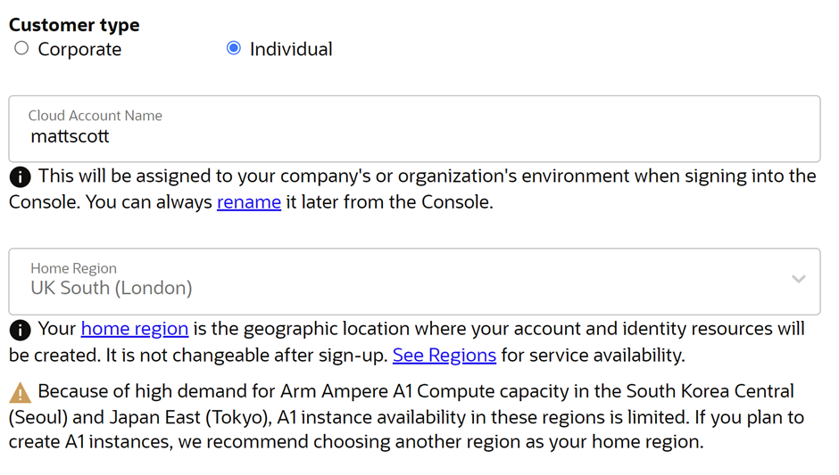

# Oracle Cloud Talos Example

This repository provisions an opinionated Talos Kubernetes cluster on Oracle Cloud Infrastructure (OCI) with Terraform. The current flow is built around a custom Oracle-compatible Talos image, Terraform Cloud remote runs, a public OCI Network Load Balancer for the Kubernetes and Talos APIs, Cilium installed by Helm, and Flux bootstrapped into a separate GitHub repository.

The repository has changed meaningfully from the older "manually create a bucket and upload an image" workflow. Terraform now creates the bucket, uploads the image archive, imports the custom image, creates the compute instances, bootstraps Talos, installs Cilium, creates a GitHub deploy key for Flux, bootstraps Flux into a second repository, and currently commits the Sealed Secrets public certificate into that Flux repository as the default secret-management bootstrap.

## What This Repository Currently Creates

- A dedicated OCI compartment.
- A VCN with:
  - a public subnet at `10.0.0.0/24`
  - a private subnet at `10.0.1.0/24`
  - an internet gateway
  - a NAT gateway
  - a service gateway
- A modified default security list that currently:
  - allows all egress
  - allows all ingress from the NAT gateway IP
  - allows all ingress from the network load balancer IP
  - allows all ingress from `10.0.0.0/8`
  - allows all ingress from `${var.personal_ip}/32`
  - exposes TCP `6443`
  - exposes TCP `50000-50001`
  - exposes UDP `51820`
  - exposes UDP `51871`
- An Object Storage bucket for Talos image archives.
- An uploaded `oracle-arm64.oci` object in that bucket.
- An imported custom OCI image named `Talos ARM64`.
- One public OCI Network Load Balancer named `talos-nlb`.
- One Talos control plane instance and one Talos worker instance in the private subnet.
- Talos bootstrap, Talos client config generation, and Kubernetes client config generation.
- A Helm-installed Cilium deployment with Hubble Relay and Hubble UI enabled.
- A GitHub deploy key for Flux.
- A Flux bootstrap into a second GitHub repository.
- By default, a committed `pub-sealed-secrets.pem` file in the Flux repository path.

## Current Topology And Defaults

These defaults matter when deciding whether the repository matches what you want to run:

- The cluster is currently a `1 control plane + 1 worker` deployment.
- Both nodes use the `VM.Standard.A1.Flex` ARM shape.
- Both nodes use `2` OCPUs, `12` GB of RAM, and `100` GB boot volumes.
- The nodes are created without SSH keys. This is a Talos-managed cluster, so the intended access path is `talosctl`, not SSH.
- The Talos module enables scheduling on control planes, so workloads are allowed to land on the control plane node.
- The Talos module enables:
  - `hostDNS`
  - `kubePrism` on port `7445`
  - `kubespan`
- The Kubernetes API endpoint list is built from:
  - `cluster_domain_endpoint`, if you set one
  - the OCI network load balancer IP
- The default Flux repository name is `fleet-infra`.
- The default Flux repository path is `clusters/talos-cluster`.
- The default root Talos image version metadata is `1.12.6`.
- The default Talos extension list exposed at the root is `["crun"]`.
- The Talos module itself currently defaults to Talos `v1.12.6` and Kubernetes `1.35.3`.

## Technologies Used: What And Why

### Oracle Cloud Infrastructure (OCI)

What it is:

- The cloud platform this repository targets.
- It provides the compartment, networking, Object Storage bucket, custom image import, ARM compute instances, and network load balancer.

Why this repository uses it:

- The entire project is built around running Talos on Oracle ARM instances, specifically `VM.Standard.A1.Flex`.
- Oracle Cloud has a notably generous Always Free tier for Ampere A1 compute, with `4` total OCPUs and `24` GB of memory that can be allocated flexibly across instances.
- Oracle also includes `200` GB total of Always Free block storage for boot volumes and block volumes combined in the home region, which is enough to make a small Talos cluster practical for testing and homelab-style use.
- OCI supports importing a custom Talos image, which is necessary because Talos is not used here as a stock marketplace image.
- Object Storage gives Terraform a place to upload the Oracle-compatible image archive before importing it as a bootable custom image.
- The current `1 control plane + 1 worker` layout in this repository maps naturally onto that free-tier-style footprint, as long as you stay within Oracle's current limits and can get A1 capacity in your chosen region.

### Terraform

What it is:

- The infrastructure-as-code tool that defines and applies the OCI, GitHub, Flux, Helm, and Talos resources.

Why this repository uses it:

- It gives the whole cluster lifecycle a declarative source of truth.
- It lets the repository stitch together cloud infrastructure, node provisioning, Talos bootstrap, Kubernetes add-ons, and GitOps bootstrap in one apply.
- The module layout in this repository keeps OCI image import, compute provisioning, and Talos config generation separated but composable.

### Terraform Cloud

What it is:

- The remote execution and state backend workflow this repository is written around.

Why this repository uses it:

- It centralizes state and makes it easier to run applies against OCI without relying only on one local workstation.
- It gives a place to store sensitive OCI and GitHub credentials as workspace variables.
- The README flow assumes remote runs first, then a local `backend.tf` and `terraform output -json` workflow afterward for Talos access files.

### Talos Linux

What it is:

- A secure, minimal, Kubernetes-focused operating system for running cluster nodes.

Why this repository uses it:

- It keeps the node OS minimal, security-focused, and API-driven, which fits well with reproducible cluster provisioning.
- The repository intentionally avoids SSH-based node management and instead relies on `talosctl` and machine configuration documents.
- It is purpose-built for Kubernetes rather than being a general-purpose Linux distribution with Kubernetes added later.
- Talos is designed around ideas that fit this repository well: immutable infrastructure, declarative configuration, and secure-by-default node management.
- Talos integrates cleanly with automated machine config generation and bootstrap through the Terraform Talos provider.

### Talos Image Factory

What it is:

- The Talos image and installer generation service used to build Oracle-compatible Talos artifacts and installer URLs.

Why this repository uses it:

- OCI needs a custom image archive in the right format, and the repository's `build_oracle_image.py` flow starts from the final Talos Image Factory page URL.
- The Terraform Talos module also uses the Talos Image Factory provider data sources to resolve extension-aware installer images.
- This gives you control over the Talos version and system extensions instead of hard-coding a single immutable image forever.

### `qemu-img`

What it is:

- The disk conversion tool used by `build_oracle_image.py`.

Why this repository uses it:

- The helper script downloads a Talos raw disk image and converts it into the `qcow2` format expected by Oracle's BYOI import workflow.
- Without it, the repository cannot produce the `oracle-arm64.oci` archive that Terraform uploads to OCI Object Storage.

### GitHub

What it is:

- The source-control platform used for the Terraform repository and the separate Flux repository.

Why this repository uses it:

- Terraform Cloud watches the Terraform repository.
- Flux is bootstrapped against a second GitHub repository so cluster state can be managed through GitOps.
- The GitHub provider creates the deploy key that allows Flux to pull from that repository.

### FluxCD

What it is:

- A GitOps operator that continuously reconciles Kubernetes state from a Git repository.

Why this repository uses it:

- It separates infrastructure bootstrapping from ongoing cluster application management.
- Terraform gets the cluster to a usable state, then Flux takes over continuous reconciliation from `flux_repository_path`.
- Once that GitOps loop is in place, the declarative workflow is usually simpler to manage than continuing to rely on ad hoc manual cluster changes.
- Flux continuously reconciles the cluster against the desired state in Git, which reduces drift and makes ongoing management more predictable.
- This repository also writes the Sealed Secrets public certificate into the Flux repository so secrets workflows can build on that bootstrap.

### Helm

What it is:

- The Kubernetes package manager used here through the Terraform Helm provider.

Why this repository uses it:

- The repository installs Cilium directly during Terraform apply.
- Using the Helm provider keeps that bootstrap step inside the same workflow as cluster creation instead of requiring a separate manual install step.

### Cilium

What it is:

- The Kubernetes CNI and networking layer this repository installs into the cluster.

Why this repository uses it:

- Kubernetes needs a CNI before the cluster is fully useful.
- The current configuration enables features such as kube-proxy replacement, Hubble Relay, and Hubble UI.
- Installing it immediately after Talos bootstrap gives the cluster a working networking stack as part of the same provisioning flow.

### Sealed Secrets / `kubeseal` (Current Default, Not Mandatory)

What it is:

- The Bitnami Sealed Secrets tooling for encrypting Kubernetes secrets so they can live safely in Git.

Why this repository uses it:

- The current Terraform workflow fetches the Sealed Secrets public certificate and commits it into the Flux repository.
- That gives downstream GitOps workflows a starting point for managing encrypted secrets in Git instead of handling raw secret manifests.
- This is an opinionated default, not a hard requirement for the overall platform design.
- If you prefer an external secret store, a cloud secret manager integration, SOPS, Vault, External Secrets Operator, or another approach, you can replace this part of the workflow with the secret-management model you prefer.

### `talosctl`

What it is:

- The Talos administrative CLI.

Why this repository uses it:

- It is the primary operational interface for this cluster because the nodes are not managed over SSH.
- `get_talos_files.py` writes `~/.talos/config` and then uses `talosctl kubeconfig` to make local Kubernetes access work.

### `kubectl`

What it is:

- The standard Kubernetes CLI.

Why this repository uses it:

- Once Talos has generated a kubeconfig, `kubectl` becomes the normal day-to-day client for verifying node health and interacting with workloads in the cluster.

## Important Caveats

These are the main places where the current repository behavior differs from what a quick read might otherwise imply.

### 1. `talos_image_version` And The Talos Module Version Are Not The Same Setting

The root variable `talos_image_version` controls the version metadata used when Terraform imports the uploaded OCI image. That value is consumed by the OCI image import module.

The Talos machine configuration module uses its own `talos_version` default, which currently lives in `modules/talos/variables.tf` and defaults to `v1.12.6`. That version is not currently exposed as a root variable. The defaults currently align, but they are still separate settings. If you build a different Talos OCI image later, update the module's Talos version too so the imported boot image and the generated Talos installer/machine configs stay aligned.

### 2. `talos_extensions` Should Match What You Selected In Talos Image Factory

The OCI image you build with `build_oracle_image.py` comes from the final Talos Image Factory page URL you pass to the script.

Separately, the Terraform Talos module uses `talos_extensions` to generate a Talos Image Factory schematic and installer image URL. If your Terraform `talos_extensions` value does not match the extensions you used when building the OCI image, you will have drift between the image you boot and the installer image Talos is told to use.

### 3. `get_talos_files.py` Requires Outputs That Are Currently Commented Out

The helper script `get_talos_files.py` reads:

- `controlplane_machine_configuration`
- `worker_machine_configuration`
- `talosconfig`

from `terraform output -json`.

However, the root outputs in `outputs.tf` are currently commented out. As the repository stands today, you must uncomment those outputs before `python get_talos_files.py` will work.

### 4. `cluster_domain_endpoint` Changes Which Endpoint `get_talos_files.py` Uses

The Talos module puts `cluster_domain_endpoint` first in the endpoint list when you set it. `get_talos_files.py` then reads the first endpoint from `talosconfig` and runs:

```bash
talosctl kubeconfig --force -n <first-endpoint>
```

That means if you set `cluster_domain_endpoint`, your DNS must already resolve that host to the OCI load balancer before you run the helper script locally.

### 5. `personal_ip` Is Intended To Be An IPv4 Address, But Its Validation Is Currently Inconsistent

`main.tf` appends `/32` to `var.personal_ip`, so the practical intent is still "enter a raw IPv4 address like `203.0.113.10`". The current validation block in `variables.tf` does not perfectly reflect that intent. Treat the variable as "plain public IPv4 address only" even though the validation text and regex are currently out of sync.

### 6. Remote Terraform Cloud Runs Need Access To The Image Archive In The Repository Working Directory

The OCI image upload resource reads the local file path in `talos_image_file`, which defaults to:

```text
build/oracle-image/oracle-arm64.oci
```

In a Terraform Cloud remote run, that file has to exist in the uploaded working directory for the run. In practice, that means your VCS-connected workspace must have access to the built `.oci` archive at that path, or you need to change how you execute Terraform.

### 7. The Flux Repository Must Already Exist

Terraform looks up `flux_repository_name` as an existing GitHub repository and then bootstraps Flux into it. The repository is not created by this Terraform configuration. Create it first.

## Repository Layout

These are the files that matter most when you are changing behavior:

- `main.tf`: root orchestration, OCI networking, NLB, Talos, Cilium, Flux, GitHub, and Sealed Secrets certificate flow.
- `variables.tf`: root variables, including OCI auth, image archive path, Talos extensions, and Flux repository settings.
- `outputs.tf`: currently commented root outputs that `get_talos_files.py` expects.
- `build_oracle_image.py`: converts a Talos Image Factory Oracle image into the `oracle-arm64.oci` archive OCI expects for BYOI import.
- `get_talos_files.py`: reads Terraform outputs and writes local Talos and machine configuration files.
- `modules/oci_talos_image`: bucket creation, image upload, and OCI custom image import.
- `modules/oci_talos`: compute instances, load balancer listeners and backends.
- `modules/talos`: Talos machine config generation, image factory schematic resolution, bootstrap, and kubeconfig generation.

## Prerequisites

### Required

- Access to a terminal or command line.
- Basic familiarity with cloud concepts and Terraform.
- A GitHub account.
- [Kubectl](https://kubernetes.io/docs/tasks/tools)
- [Python](https://www.python.org/downloads)
- [Talos CLI](https://www.talos.dev/latest/talos-guides/install/talosctl)
- [Terraform CLI](https://developer.hashicorp.com/terraform/install)
- `qemu-img`: required by `build_oracle_image.py` to convert the Talos raw image into Oracle's required `qcow2` format.
- `curl` and `tar`: useful if you ever run Terraform locally, because the current Flux bootstrap flow executes shell commands that download and unpack `kubeseal`.

No separate decompression tool is required for the default image-build workflow because `build_oracle_image.py` uses Python's built-in `gzip` support.

### Preserved Older Recommendations That Are Now Optional

- [7-Zip](https://www.7-zip.org/download.html): not required for the current default build flow, but still useful if you want to inspect or manipulate archives manually, especially on Windows.
- [GitHub Desktop](https://github.com/apps/desktop): optional convenience tool if you prefer not to clone and commit from the terminal.
- [Kubeseal](https://github.com/bitnami-labs/sealed-secrets): only needed if you want to keep using the current Sealed Secrets-based secret flow instead of replacing it with another secret-management approach.

### Getting `qemu-img`

- macOS: install QEMU with Homebrew using `brew install qemu`, or with MacPorts using `sudo port install qemu`.
- Linux: install the package that provides `qemu-img`. Common options are `apt-get install qemu-utils` on Debian/Ubuntu, `dnf install qemu-img` on Fedora, `pacman -S qemu` on Arch, and `zypper install qemu` on SUSE.
- Windows: first install [Chocolatey](https://chocolatey.org/install), then install `qemu-img` from [the qemu-img package](https://community.chocolatey.org/packages/qemu-img).

## Optional Kubernetes UI

- One Kubernetes UI, if desired: [Lens](https://lenshq.io/download), [k9s](https://k9scli.io/topics/install/), or [Headlamp](https://headlamp.dev/docs/latest/installation/)

## Steps

1. Create an Oracle Cloud trial account:
   - Sign up at [Oracle Cloud](https://signup.cloud.oracle.com/).
   - Verify your email, then choose your cloud account name and home region.
   - Be aware that Oracle's ARM-based `A1` capacity is not available in every region, so choose a home region that supports it.

   

   - Complete your contact and billing details. Oracle performs a small temporary card verification charge during signup. Your card will not actually get charged.
   - After the account is active, sign in and familiarize yourself with the Oracle Cloud console.
   - Convert the account to Pay As You Go under `Billing and Cost Management` -> `Upgrade and Manage Payment`. This is required for the Oracle services used by this repo.
2. Use this repository as a template repository to make your own.
   - Create your own copy so you can safely change variables, backend settings, and Flux settings without modifying the original repository.
   - On GitHub, click `Use this template`, create a new repository under your account or organization, and choose a name you will recognize later in Terraform Cloud.
   - If you prefer not to use the template workflow, you can also create a new empty repository and copy the files in manually, but the template path is simpler.
3. Clone the repository locally.
   - Clone your new repository to your workstation so you can edit files, generate the image archive, and run helper commands later.
   - Example:

     ```bash
     git clone https://github.com/YOUR_GITHUB_USERNAME/YOUR_REPO_NAME.git
     cd YOUR_REPO_NAME
     ```

   - If you use GitHub Desktop, you can clone it graphically instead of using the terminal.
4. Decide what bucket name Terraform should create for the Talos image archive.
   - This repository now creates the Oracle Object Storage bucket for you during `terraform apply`.
   - Pick a globally unique bucket name and set it as `talos_images_bucket`.
   - Terraform will create that bucket in the compartment it creates, upload `oracle-arm64.oci` into it, and then import the custom Oracle image from that object.
5. Decide what Talos version and extension set you want to run before building the image.
   - This matters because the repository currently has multiple places where Talos version and extension data show up.
   - Keep these aligned:
     - the version you select in Talos Image Factory
     - the version encoded into the built OCI image archive
     - `talos_image_version` at the root
     - the Talos module version in `modules/talos/variables.tf`
     - `talos_extensions`
   - If you choose additional extensions in Talos Image Factory, plan to update `talos_extensions` from its default value of `["crun"]`.
6. Generate the Oracle-compatible Talos image.
   - Open [Talos Image Factory](https://factory.talos.dev/?target=cloud).
   - Under `Choose Talos Linux Version`, select the version you want to run.
   - On the next page, under `Cloud`, choose `Oracle Cloud`.
   - On the next page, set `Machine Architecture` to `arm64`.
   - On the `System Extensions` page, review the full list and select every extension you know you need.
   - If you are unsure, select `crun` at minimum.
   - `crun` is the current default in this repository.
   - On the `Customization` page, leave the bootloader set to `auto` unless you intentionally know you need something else.
   - Once you reach the final Image Factory page, copy the page URL from your browser. It will look something like this:

     ```bash
     https://factory.talos.dev/?arch=arm64&bootloader=auto&cmdline-set=true&extensions=-&extensions=siderolabs%2Fcrun&platform=oracle&target=cloud&version=1.12.6
     ```

   - Run the helper script in this repository with that final page URL:

     ```bash
     python build_oracle_image.py "https://factory.talos.dev/?arch=arm64&bootloader=auto&cmdline-set=true&extensions=-&extensions=siderolabs%2Fcrun&platform=oracle&target=cloud&version=1.12.6"
     ```

   - The helper script will:
     - fetch the final Talos Image Factory HTML page
     - extract the `Disk Image` URL from the page
     - change that URL from `oracle-arm64.qcow2` to `oracle-arm64.raw.gz`
     - derive `operatingSystemVersion` from the version in the URL
     - download the raw Talos image archive
     - create `image_metadata.json`
     - decompress the raw image
     - convert the raw image to `oracle-arm64.qcow2`
     - package everything into `oracle-arm64.oci`
   - By default, the generated files are written to `build/oracle-image/`.
   - After packaging finishes, the script automatically deletes the downloaded and intermediate files, leaving only the final `oracle-arm64.oci` archive.
   - If you want to keep the intermediate files for debugging, run the script with `--keep-intermediates`.
   - Terraform defaults to reading `build/oracle-image/oracle-arm64.oci` from `talos_image_file`.
   - If you want to keep the file somewhere else, set `talos_image_file` to that relative path instead.
7. Make sure the repository configuration matches the image you just built.
   - Set or override `talos_image_version` so it matches the Talos version you selected in Talos Image Factory.
   - Set or override `talos_extensions` so it matches the official extension names you selected in Talos Image Factory.
   - If you changed Talos versions, also update the default `talos_version` in `modules/talos/variables.tf` because the root module does not currently expose that setting.
8. Decide how Terraform Cloud will access the image archive.
   - During `terraform apply`, this repo will:
     - create the Object Storage bucket named by `talos_images_bucket`
     - upload the local `.oci` file referenced by `talos_image_file`
     - create the OCI custom image from that uploaded object
   - The object name in OCI is currently fixed to `oracle-arm64.oci` even if your local source file has a different filename.
   - If you are using Terraform Cloud remote runs, the archive has to be available in the uploaded working directory for the run.
   - The repository does not currently ignore `build/oracle-image/`, so decide deliberately whether you want to commit the archive, store it another way, or use a different execution model.
9. [Create an Oracle API key](https://cloud.oracle.com/identity/domains/my-profile/api-keys).
   - Terraform uses the OCI provider, which authenticates with an Oracle API key instead of your interactive browser session.
   - Open your Oracle profile, find the API key section, and begin creating a new key pair.
10. Click `Add API Key`.
    - Oracle will guide you through generating a new private key and public key association for your user account.
    - Use a fresh API key dedicated to automation if possible. That makes it easier to rotate or revoke later.
11. Click `Add` after downloading the private key.
    - Save the downloaded private key somewhere safe on your local machine.
    - Do not commit this file into git. You will only use its contents to populate a sensitive Terraform Cloud variable.
12. For the new API key, click the three-dot menu and then `View configuration file`.
    - Oracle will show you a config snippet with the exact values Terraform needs.
    - This usually includes `user`, `fingerprint`, `tenancy`, `region`, and the expected `key_file` path.
13. Copy and note the values from that configuration file.
    - You will use these values directly when creating Terraform Cloud variables.
    - Keep the keys and values exactly as shown.
    - Example of the values you care about:

      ```text
      fingerprint=12:34:56:78:90:ab:cd:ef:...
      region=us-ashburn-1
      tenancy=ocid1.tenancy.oc1...
      user=ocid1.user.oc1...
      ```

14. [Sign up for Terraform Cloud](https://app.terraform.io).
    - This repository is written around Terraform Cloud remote runs.
    - After signing in, create or choose the organization where you want this workspace to live.
15. Create a VCS project in Terraform Cloud and note the project name.
    - A project is just a logical container for one or more workspaces.
    - Give it a clear name such as `oracle-talos` so the purpose remains obvious later.
16. Create a workspace in Terraform Cloud under that project and note the workspace name.
    - Connect the workspace to the GitHub repository you created in step 2.
    - Choose the branch you want Terraform Cloud to track, usually `main`.
    - The workspace name and project name are both needed later when you create `backend.tf`.
17. [Create a classic GitHub personal access token with repo access](https://github.com/settings/tokens/new) and note the value.
    - This repository interacts with a separate Flux repository through the GitHub provider, so Terraform needs a token with permission to read and modify repositories.
    - A classic token with `repo` scope is the simplest option for this setup.
    - Save the token value immediately. GitHub only shows it once.
18. [Create a new repository named `fleet-infra` from this template](https://github.com/new?template_name=oracle-talos-flux-example&template_owner=kanya-approve&name=fleet-infra).
    - This repository is used by Flux and is separate from the Terraform repository you are editing now.
    - The default variable `flux_repository_name` in this repo is `fleet-infra`, so using that same name avoids extra configuration.
    - If you choose a different name, update the Terraform variable `flux_repository_name` accordingly.
    - Terraform expects the repository to already exist before apply.
19. In the Terraform Cloud workspace, create a Terraform variable named `cluster_domain_endpoint`.
    - Use your DNS name if you already have one pointed at the cluster API endpoint.
    - If you do not have a domain name, leave it empty and Terraform will fall back to using the Oracle network load balancer IP.
    - Enter only the hostname or FQDN, not `https://` and not a port.
    - If you set this, make sure DNS is working before you run `get_talos_files.py`, because the helper script will use the first endpoint from `talosconfig`.
20. Create a Terraform variable named `fingerprint`.
    - Set it to the value after `fingerprint=` from step 13.
    - This is required by the OCI provider in `provider.tf`.
21. Create a Terraform variable named `region`.
    - Set it to the value after `region=` from step 13, for example `us-ashburn-1`.
    - This must match the region where your Oracle resources and bucket live.
22. Create a Terraform variable named `tenancy_ocid`.
    - Set it to the value after `tenancy=` from step 13.
    - The variable name in this repo is `tenancy_ocid`, not just `tenancy`.
23. Create a Terraform variable named `user_ocid`.
    - Set it to the value after `user=` from step 13.
    - This identifies the Oracle user associated with the API key you created.
24. Create a Terraform variable named `talos_images_bucket`.
    - Set it to the exact bucket name you picked in step 4.
    - Terraform will create the bucket and use it to store the uploaded image archive before importing the OCI image.
25. Create a sensitive Terraform variable named `private_key`.
    - Set it to the base64-encoded contents of the private key file you downloaded in step 11.
    - The OCI provider in `provider.tf` decodes this value with `base64decode(...)`.
    - Example command on GNU `base64` systems:

      ```bash
      base64 -w 0 path/to/oci_api_key.pem
      ```

    - On macOS, if `-w` is not supported, use:

      ```bash
      base64 path/to/oci_api_key.pem | tr -d '\n'
      ```

26. Create a sensitive Terraform variable named `personal_ip`.
    - Set it to your public IPv4 address, for example `203.0.113.10`.
    - The security-list rule in `main.tf` appends `/32`, so enter only the IPv4 address itself.
    - Be aware that the current validation block in `variables.tf` is inconsistent with the runtime use of the variable. The intended input is still a plain IPv4 address.
27. Create a sensitive environment variable named `GITHUB_TOKEN`.
    - In Terraform Cloud, make this an environment variable rather than a Terraform input variable.
    - Set it to the GitHub personal access token from step 17.
    - This is used by the GitHub provider to create the Flux deploy key and interact with the Flux repository.
28. Optionally create Terraform variables for the newer configurable image and Flux settings.
    - `talos_image_file`
      - default: `build/oracle-image/oracle-arm64.oci`
      - set this if your generated `.oci` archive lives somewhere else in the repository
    - `talos_image_version`
      - default: `1.12.6`
      - set this so OCI image metadata matches the Talos image you built
    - `talos_extensions`
      - default: `["crun"]`
      - set this to the exact list of official extension names you selected in Talos Image Factory
    - `flux_repository_path`
      - default: `clusters/talos-cluster`
      - set this if you want Flux bootstrapped somewhere else inside the Flux repository
    - `ad_number`
      - default: `1`
      - change this if Oracle capacity for `VM.Standard.A1.Flex` is only available in another availability domain for your region
29. Start a Terraform Cloud run.
    - Queue a plan and apply from the Terraform Cloud workspace once all variables are set.
    - During the run, Terraform will create OCI networking, the compartment, the bucket, the uploaded image object, the custom image, the load balancer, the Talos instances, Talos configuration, Cilium, and the supporting GitHub/Flux material.
    - The first run can take a while because Oracle image import and instance provisioning are not instant.
30. In your local repository folder, create a `backend.tf` file with the contents below.
    - This tells your local Terraform CLI how to talk to the same Terraform Cloud workspace you just used remotely.
    - Replace the placeholders with your Terraform Cloud organization, project, and workspace names from steps 15 and 16.

    ```hcl
    terraform {
        cloud {
            organization = "REPLACE_WITH_YOUR_ORGANIZATION_NAME"

            workspaces {
                name = "REPLACE_WITH_YOUR_WORKSPACE_NAME"
                project = "REPLACE_WITH_YOUR_PROJECT_NAME"
            }
        }
    }
    ```

31. Authenticate your local Terraform CLI to Terraform Cloud.
    - Run:

      ```bash
      terraform login
      ```

    - Complete the browser-based login flow so `terraform output -json` can read from the remote workspace later.
32. Uncomment the root outputs in `outputs.tf` before running the helper script.
    - `get_talos_files.py` expects these outputs to exist:
      - `controlplane_machine_configuration`
      - `worker_machine_configuration`
      - `talosconfig`
    - Right now they are commented out in `outputs.tf`.
    - Remove the leading `#` characters from the output blocks or otherwise restore equivalent outputs before continuing.
33. In your repository folder, run `python get_talos_files.py`.
    - This helper script runs `terraform output -json`.
    - It extracts:
      - the rendered Talos control plane machine configuration
      - the rendered Talos worker machine configuration
      - the rendered Talos client config
    - It writes the following files locally:
      - `~/.talos/config`
      - `./talosconfig`
      - `./controlplane.yaml`
      - `./worker.yaml`
    - It also runs `talosctl kubeconfig --force -n <first-endpoint>` so that `kubectl` can talk to the new cluster.
    - Before running the script, make sure:
      - your local checkout contains the `backend.tf` file from step 30
      - you are authenticated to Terraform Cloud in your local CLI
      - the outputs in `outputs.tf` are enabled
      - `terraform`, `python`, and `talosctl` are installed
34. Verify cluster access.
    - Examples:

      ```bash
      kubectl get nodes
      talosctl config info
      talosctl health
      ```

## Root Variables Worth Knowing About

The README steps above cover the important ones, but this section is useful when you are auditing or modifying behavior.

### Required In Practice

- `fingerprint`: OCI API key fingerprint.
- `private_key`: base64-encoded OCI private key content.
- `region`: OCI region.
- `tenancy_ocid`: OCI tenancy OCID.
- `user_ocid`: OCI user OCID.
- `talos_images_bucket`: bucket name Terraform will create and use for image import.
- `personal_ip`: intended to be your public IPv4 address.

### Optional But Operationally Important

- `cluster_domain_endpoint`: hostname for the cluster API, if you already have DNS set up.
- `talos_image_file`: relative path to the `.oci` archive Terraform uploads.
- `talos_image_version`: version metadata used for OCI custom image import.
- `talos_extensions`: extension list for the Talos Image Factory schematic in the Terraform Talos module.
- `flux_repository_name`: existing GitHub repository used for Flux.
- `flux_repository_path`: path inside the Flux repository where bootstrap content is written.
- `ad_number`: OCI availability domain number to target.

### Defaults That Require Code Changes Instead Of Workspace Variables

These are currently inside modules, not exposed at the root:

- Talos cluster version default: `modules/talos/variables.tf`
- Kubernetes version default: `modules/talos/variables.tf`
- Cluster name default: `modules/talos/variables.tf`
- Node counts and shapes: `modules/oci_talos/main.tf`

## Post-Apply Notes

- Because the cluster is currently only one control plane and one worker, plan maintenance carefully.
- Because control plane scheduling is enabled, workloads may run on the control plane node.
- Because the nodes are in a private subnet and no SSH keys are configured, your normal operational path is through the Talos API, the Kubernetes API, and the OCI console, not SSH.
- Flux bootstrap writes into `flux_repository_path`, and the Sealed Secrets public certificate is committed there as `pub-sealed-secrets.pem`.
- That Sealed Secrets bootstrap is only the current default. You can replace it with an external secret store or another secret-management workflow if that better fits your environment.
- If you change the image version or extensions later, keep the image build inputs, `talos_image_version`, `talos_extensions`, and the Talos module version in sync.
